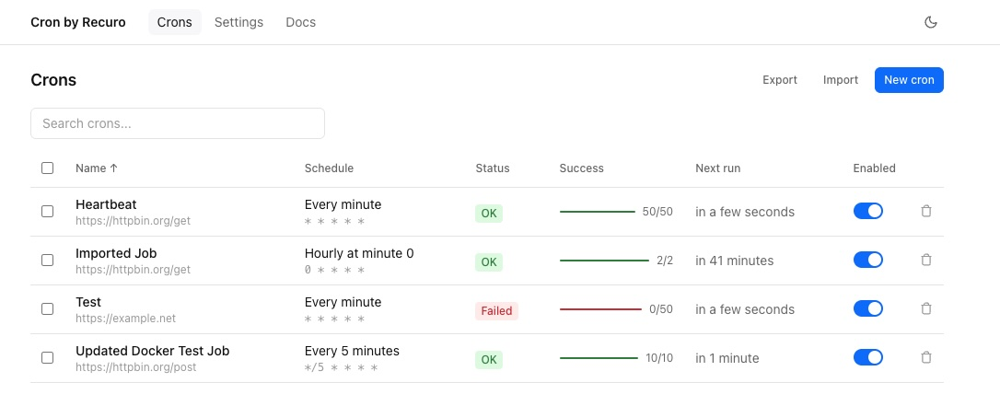
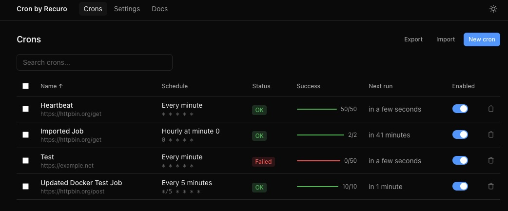
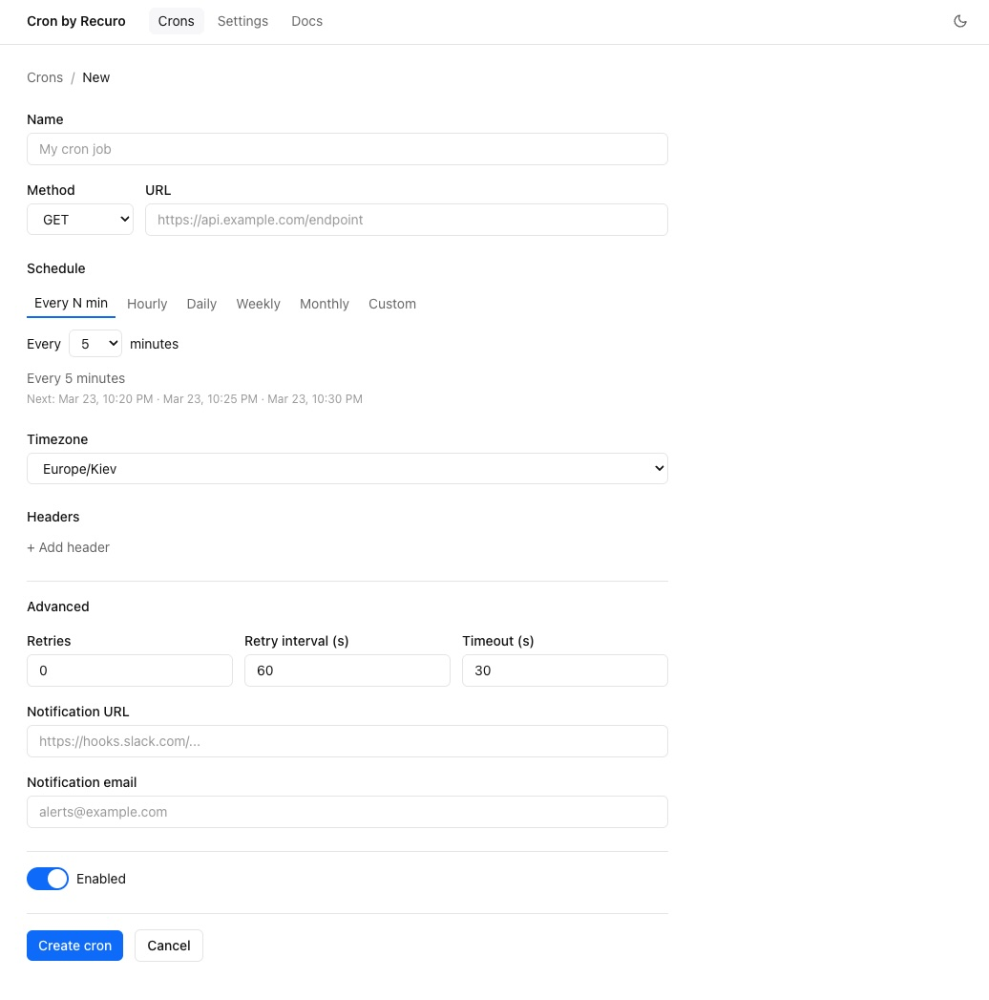
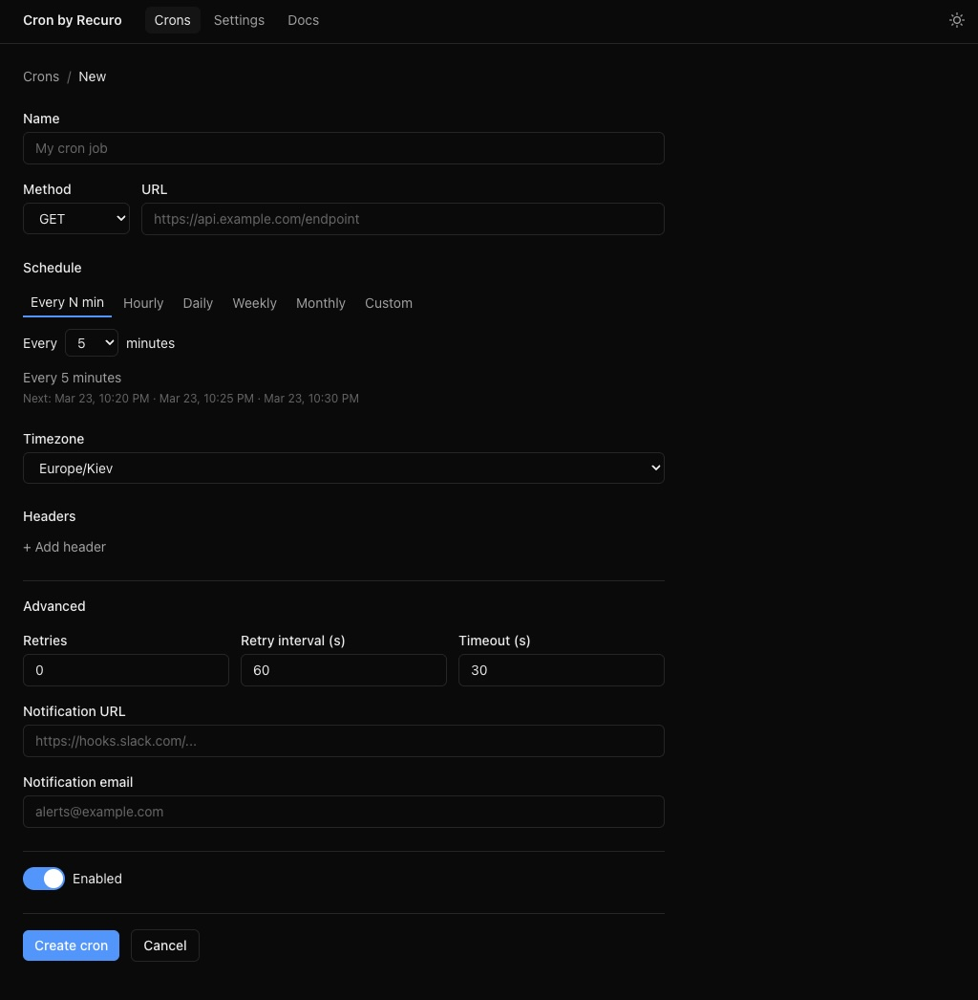
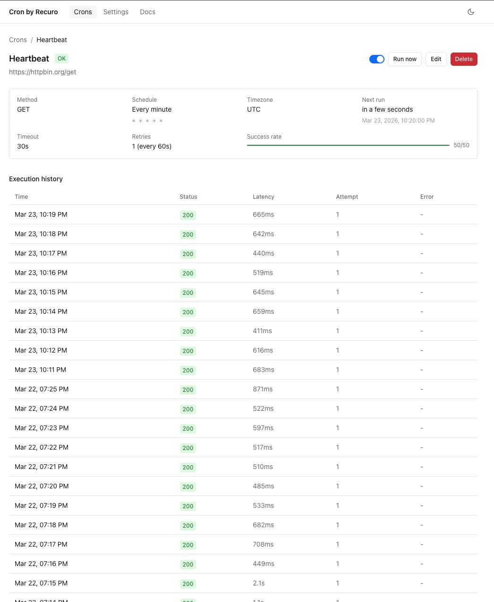
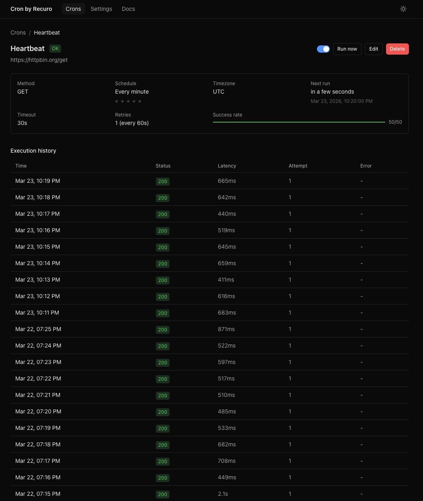

# cron-as-a-service

**A modern, self-hosted cron-as-a-service with a web dashboard. `docker compose up -d` and you're running.**

[](https://github.com/recurohq/cron-as-a-service/stargazers)
[](LICENSE)

<!-- TODO: Add full-width dashboard screenshot (dark mode) -->
<!--  -->

---

## Why This Exists

Existing cron-as-a-service tools are either abandoned, expensive SaaS, or overkill enterprise schedulers. This gives you a complete self-hosted cron job scheduler and webhook scheduler with a web dashboard -- create jobs, see execution history, get failure alerts -- with `docker compose up -d` and zero configuration.

---

## Features

### Dashboard UI
A clean web interface to create, edit, monitor, and manage all your cron jobs. Search and filter jobs by name, URL, or expression. Sort by name, next run, success rate, or last status. Bulk select jobs to enable, disable, or delete in one click.

### Interactive Cron Builder
No need to memorize cron syntax. A tabbed schedule builder lets you pick from common patterns -- every N minutes, hourly, daily, weekly, or monthly -- or write a custom expression. Every schedule shows a plain English preview (e.g., "Monday, Wednesday at 2:30 PM") and the next 3 execution times.

### Full HTTP Support
Trigger any URL with GET, POST, PUT, PATCH, or DELETE. Set custom headers and request body per job. Configurable timeout per request (default 30s).

### Execution History & Stats
Every execution is logged with status code, response body (up to 10KB), latency in ms, and error details. See job health at a glance with success/failure counts (e.g., "47/50"). Paginated execution table per job with full audit trail.

### Retry with Exponential Backoff
Configure retry count and interval per job. Failed requests (connection errors, 5xx responses) are retried automatically with exponential backoff (e.g., 60s, 120s, 240s). 4xx responses are not retried. Notifications are sent only after all retries are exhausted.

### Failure Alerts
Get notified when jobs fail via email (SMTP) or webhook. Set notification targets per job or use global defaults. Webhook payloads include full job metadata and execution details as JSON.

### Timezone Support
Every job can run in any IANA timezone. Schedule a job in `America/New_York` and another in `Asia/Tokyo` -- each fires at the correct local time.

### Import / Export
Bulk export all jobs as a versioned JSON file. Import jobs from JSON with automatic validation and per-job error reporting. Imported jobs are immediately scheduled if enabled.

### Overlap Prevention & Concurrency
Up to 10 jobs can execute concurrently with queue-based throttling. If a job is still running when its next schedule fires, the new execution is skipped to prevent overlap.

### Dark Mode
Beautiful light and dark themes with a one-click toggle.

### One-Command Deploy
`docker compose up -d` and you're running. SQLite database with zero configuration -- data persists in a Docker volume. Single `PASSWORD` env var for authentication.

### Open Source
MIT licensed. Free forever. Self-hosted. Your data stays on your server.

---

## Quick Start

```bash
git clone https://github.com/recurohq/cron-as-a-service.git
cd cron-as-a-service
cp .env.example .env   # edit PASSWORD
docker compose up -d
```

Open [http://localhost:8080](http://localhost:8080) and create your first cron job.

<!-- TODO: Add screenshot of job creation form with cron builder -->
<!--  -->

---

## Configuration

All configuration is via environment variables in your `.env` file (or `docker-compose.yml`):

| Variable | Default | Description |
|---|---|---|
| `PASSWORD` | *(required)* | Dashboard login password |
| `TZ` | `UTC` | Server timezone |
| `SESSION_DAYS` | `7` | Login session duration in days |
| `SMTP_HOST` | -- | SMTP server for email notifications |
| `SMTP_PORT` | `587` | SMTP port |
| `SMTP_USER` | -- | SMTP username |
| `SMTP_PASS` | -- | SMTP password |
| `SMTP_FROM` | -- | Sender email address |
| `RETENTION_DAYS` | `30` | Execution history retention in days |

---

## Screenshots

| View | Light | Dark |
|---|---|---|
| Jobs List |  |  |
| Job Creation |  |  |
| Job Detail |  |  |

---

## Roadmap

- [ ] REST API for programmatic access
- [ ] PostgreSQL support
- [ ] Multi-user with roles
- [ ] Prometheus metrics endpoint
- [ ] Job groups / tags

---

## Contributing

Contributions are welcome! Please read the [Contributing Guide](CONTRIBUTING.md) for details on how to get started.

## License

[MIT](LICENSE) -- free forever.
